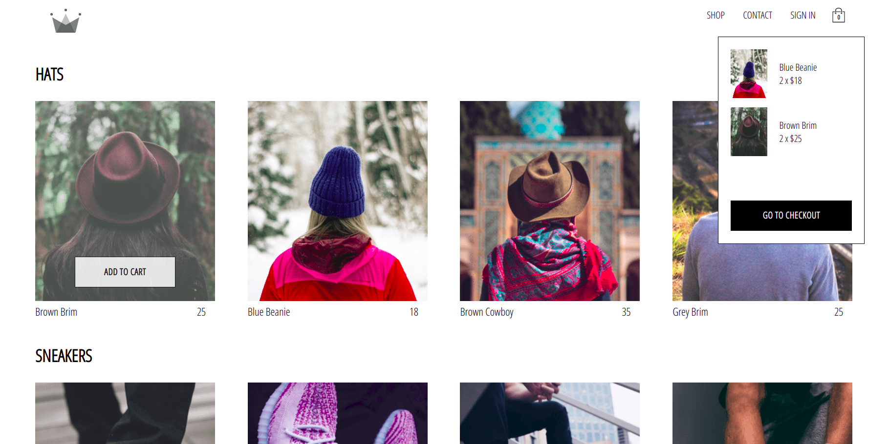

# crwn-clothing

:dart: An E-commerce app.
Topics covered will be:

- React Basics
- React Router (in progress)
- Redux
- Redux Saga
- Asynchronous Redux
- React Hooks
- Context API
- React Suspense + React Lazy
- Firebase
- Stripe API
- Styled-Components
- GraphQL
- Apollo
- PWAs
- React Performance
- React Design Patterns
- Testing with Jest, Enzyme and Snapshot testing
- React Best Practices
- Persistance + Session Storage
- State Normalization

* more



## Installation and Setup

### Required settings

- Git (https://git-scm.com/)
- Node (https://nodejs.org)
- Npm (https://www.npmjs.com/)
- Yarn (https://yarnpkg.com/)

### Cloning the repository

```
git clone https://github.com/carol-lima/react-advanced-ecommerce.git
cd react-navbar
npm install or yarn install
```

### Available Scripts

In the project directory, you can run:

```bash
yarn start
```

Runs the app in the development mode.\
Open [http://localhost:3000](http://localhost:3000) to view it in the browser.

```bash
yarn test
```

Launches the test runner in the interactive watch mode.\
See the section about [running tests](https://facebook.github.io/create-react-app/docs/running-tests) for more information.

```bash
yarn build
```

Builds the app for production to the `build` folder.\
It correctly bundles React in production mode and optimizes the build for the best performance.
